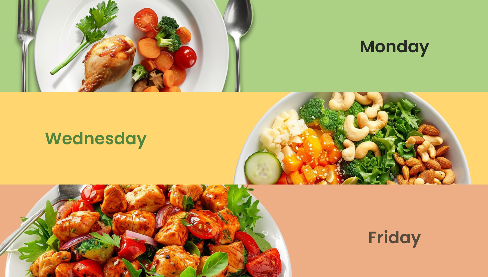

# Welcome to Plate Pal
This project focuses on developing a menu scheduling application that allows managers to create and share weekly menus for staff workers. The application ensures employees have clear visibility of the planned meals while addressing specific dietary restrictions and allergies.

## User Features
- Ability to choose week/ Date range
- Ability to see the menu details
- Ability to add Allergies if any
- User can download the menu via PDF
- API integration

### Running this project locally

**Live Version**
[Link to PlatePal App](https://platepal2.netlify.app/)

**From the repo**
   1. Clone this project locally
   2. Run `npm install` in your bash/command line
   3. Run `npm run dev` in your bash/command line
   4. Install additional dependencies (see below)

### Dependencies
 - FontAwesome
 - HeadlessUI
 - React
 - React-Calendar
 - React-DOM
 - React-Router-Dom
 - TailwindCSS-TextShadow

### Plugins
Currently, two official plugins are available:
- [@vitejs/plugin-react](https://github.com/vitejs/vite-plugin-react/blob/main/packages/plugin-react/README.md) uses [Babel](https://babeljs.io/) for Fast Refresh
- [@vitejs/plugin-react-swc](https://github.com/vitejs/vite-plugin-react-swc) uses [SWC](https://swc.rs/) for Fast Refresh

## Our Team
**Developers**

- Zephyrus Koryami(Sokuen Ryan) [GitHub](https://github.com/sokuenryan) / [LinkedIn](https://www.linkedin.com/in/sokuenryan/)

- Prerna Lele: [GitHub](https://github.com/prernalele) / [LinkedIn](https://www.linkedin.com/in/prerna-lele/)

- Brianna Duncan: [GitHub](https://github.com/BriannaD23) / [LinkedIn](https://www.linkedin.com/in/briannaduncan/)

- Lindsay Allen: [GitHub](https://github.com/lkallen) / [LinkedIn](https://www.linkedin.com/in/lindsay-allen-54b46937/)

### Special Thanks 

**Designer**
- [Breanna Bierod](https://www.linkedin.com/in/brebierod-uxdesign/) 

**Product Owner**
- Viral Barot

**Scrum Master**
- Christel

**Voyage Guide**
- Andres Benitez
